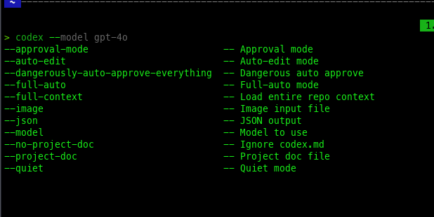
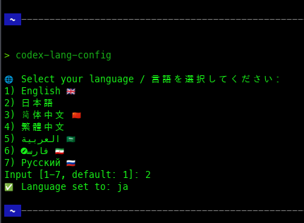
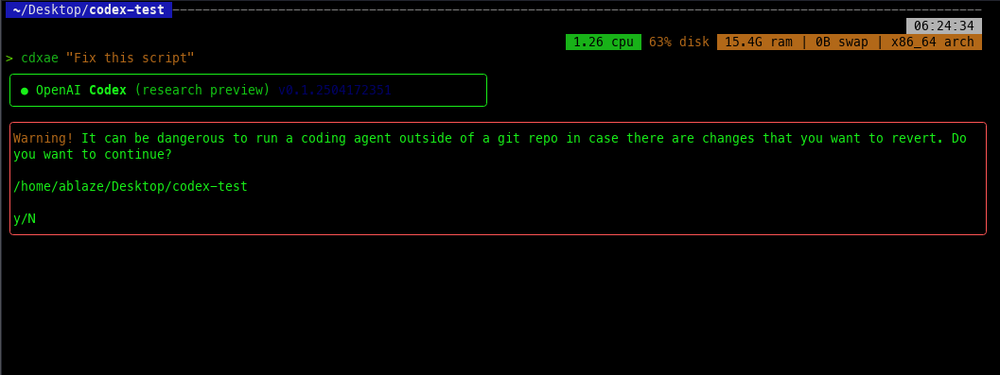

# Codex Zsh Plugin

Codex Zsh Plugin is a plugin for oh-my-zsh that provides completions, aliases, and multi-language support (7 languages) for the OpenAI Codex CLI.



## ✨ Features
- 🌐 Multilingual support (日本語 / English / 中文 / العربية / فارسی / Русский)
- ⚡ Completion (`codex -<TAB>`)
- 🔄 Language setting command with `codex-lang-config`
- 📂 Clean configuration and `oh-my-zsh` compatible design

---

## 📦 Installation

### 1. Clone this repository
```bash
git clone https://github.com/clearclown/codex-zsh-plugin \
~/.oh-my-zsh/custom/plugins/codex
```

### 2. .zshrc Edit
```zsh
plugins=(codex)
```

### 3. Restart or reload Zsh
```bash
source ~/.zshrc
```

### 4. Select language (optional)
```bash
codex-lang-config
```



---

## 🛠️ Usage example

### 🔤 Completion works!
```bash
codex -<TAB>
```


### 🧠 Auto-edit mode
```bash
cdxae "Fix this script"
```


---

## 📄 License
This repository is released under the MIT License. See [LICENSE](./LICENSE) for details.

---

## 🙏 Contribute
Pull requests, translations, and improvements are welcome! Please put `.zsh` for additional languages ​​in the `lang/` folder.

---

## 👨‍💻 Author
[Clear Clown](https://github.com/clearclown) / 2025
